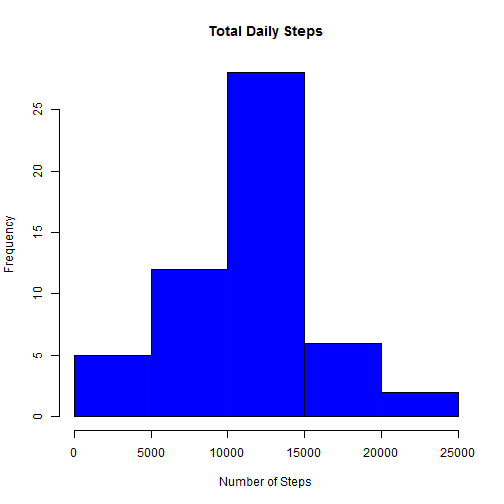

##Data

This assignment makes use of data from a personal activity monitoring device. This device collects data at 5 minute intervals through out the day. The data consists of two months of data from an anonymous individual collected during the months of October and November, 2012 and include the number of steps taken in 5 minute intervals each day.

The data can be downloaded [here](https://d396qusza40orc.cloudfront.net/repdata%2Fdata%2Factivity.zip).

First, we load the packages we need to complete the assignment.  We will use the `dplyr` package.

```r
library(dplyr)
```


We run the following code to produce a data frame named `act1` using the `activity.csv` data file. We convert the act1 data frame to the tbl class, which we can manipulate using dplyr. We examine the structure of the tbl using the str function.


```r
act1 <- read.csv("activity.csv")
act <- tbl_df(act1)
str(act)
```

```
## Classes 'tbl_df', 'tbl' and 'data.frame':	17568 obs. of  3 variables:
##  $ steps   : int  NA NA NA NA NA NA NA NA NA NA ...
##  $ date    : Factor w/ 61 levels "2012-10-01","2012-10-02",..: 1 1 1 1 1 1 1 1 1 1 ...
##  $ interval: int  0 5 10 15 20 25 30 35 40 45 ...
```

##What is the mean total number of steps taken per day?
###Calculate the total number of steps taken per day
We use the `group_by` function to group the data by date.  Then we remove NAs and summarize total steps by day using the `summarize` and `sum` functions.

```r
total <- group_by(act,date) %>% 
        na.omit() %>% 
        summarize(total_steps=sum(steps))
head(total)
```

```
## Source: local data frame [6 x 2]
## 
##         date total_steps
##       (fctr)       (int)
## 1 2012-10-02         126
## 2 2012-10-03       11352
## 3 2012-10-04       12116
## 4 2012-10-05       13294
## 5 2012-10-06       15420
## 6 2012-10-07       11015
```

###Make a histogram of the total number of steps taken each day
We use the `hist` function to create a histogram of the total steps taken each day.

```r
hist(total$total_steps,
     main="Total Daily Steps",
     col="blue",
     xlab="Number of Steps")
```



###Calculate and report the mean and median of the total number of steps taken per day
We use the `mean` and `median` functions to calculate the mean and median of the total number of steps taken per day.

####Mean

```r
o_mean <- mean(total$total_steps)
o_mean
```

```
## [1] 10766.19
```

####Median

```r
o_med <- median(total$total_steps)
o_med
```

```
## [1] 10765
```

##What is the average daily pattern?
###Make a time series plot of the 5-minute interval and the average number of steps taken, averaged across all days

First, we group the data by interval.  Then we calculate the average steps by interval across all days.

```r
int <- group_by(act,interval) %>% 
        na.omit() %>% 
        summarize(avg_steps = mean(steps))
head(int)
```

```
## Source: local data frame [6 x 2]
## 
##   interval avg_steps
##      (int)     (dbl)
## 1        0 1.7169811
## 2        5 0.3396226
## 3       10 0.1320755
## 4       15 0.1509434
## 5       20 0.0754717
## 6       25 2.0943396
```

Then we use the `plot` function to create a time series plot of the data.

```r
plot(int$interval,int$avg_steps,
     type="l",
     xlab="Interval",
     ylab="Number of Steps",
     main="Average Number of Steps per Day by Interval")
```


###Find the 5-minute interval that, on average across all days in the dataset, contains the maximum number of steps
We can use the `which.max` function to subset the data and determine which interval has the maximum number of steps on average across all days.

```r
int[which.max(int$avg_steps),1]
```

```
## Source: local data frame [1 x 1]
## 
##   interval
##      (int)
## 1      835
```

##Imputing missing values
###Calculate and report the total number of missing values in the dataset
We use the `sum` and `complete.cases` functions to calculate the total number of rows with missing data.

```r
sum(!complete.cases(act))
```

```
## [1] 2304
```

###Fill in all of the missing values in the dataset.
We will use the average value for the interval to replace any missing values.

###Create a new dataset that is equal to the original dataset but with the missing data filled in.
We will create a new dataset, `act_imp`, which will contain imputed values for any missing data.  We will first join the `int` dataset containing the average steps by interval with the `act` dataset.  Then if a value is missing, we will use `avg_steps` instead.  We then drop `avg_steps` from the dataset. 

```r
act_imp <- left_join(act,int,by="interval") %>% 
        mutate(steps=ifelse(is.na(steps),avg_steps,steps)) %>% 
        select(-avg_steps)
head(act_imp)
```

```
## Source: local data frame [6 x 3]
## 
##       steps       date interval
##       (dbl)     (fctr)    (int)
## 1 1.7169811 2012-10-01        0
## 2 0.3396226 2012-10-01        5
## 3 0.1320755 2012-10-01       10
## 4 0.1509434 2012-10-01       15
## 5 0.0754717 2012-10-01       20
## 6 2.0943396 2012-10-01       25
```

###Make a histogram of the total number of steps taken each day and calculate the mean and median total number of steps taken per day.
First we need to recalculate the total number of steps per day using our new imputed dataset.  We use the same method we used above.

```r
total_imp <- group_by(act_imp,date) %>% 
        summarize(total_steps=sum(steps))
head(total_imp)
```

```
## Source: local data frame [6 x 2]
## 
##         date total_steps
##       (fctr)       (dbl)
## 1 2012-10-01    10766.19
## 2 2012-10-02      126.00
## 3 2012-10-03    11352.00
## 4 2012-10-04    12116.00
## 5 2012-10-05    13294.00
## 6 2012-10-06    15420.00
```

We then create a histogram of the data.

```r
hist(total_imp$total_steps,
     main="Total Steps Each Day",
     col="blue",
     xlab="Number of Steps")
```


We calculate the mean and the median total number of steps taken per day using the imputed data set.

####Mean using imputed data

```r
imp_mean <- mean(total_imp$total_steps)
imp_mean
```

```
## [1] 10766.19
```
####Median using imputed data

```r
imp_med <- median(total_imp$total_steps)
imp_med
```

```
## [1] 10766.19
```

###What is the impact of imputing missing data on the estimates of the total daily number of steps?

We can calulate the difference in the mean and median between our non-imputed dataset and our imputed dataset.

####Difference in Mean

```r
o_mean - imp_mean
```

```
## [1] 0
```
We can see that the mean is identical using imputed data.  This makes sense, as we used a mean value for each interval to impute the missing values.

####Difference in Median

```r
o_med - imp_med
```

```
## [1] -1.188679
```
We can see that the median differs slightly when calculated using imputed data compared to non-imputed data.  The median for the imputed data is slightly higher.

##Are there differences in activity patterns between weekdays and weekends?

### Create a new factor variable in the dataset indicating whether a given date is a weekday or weekend day.
We use convert the `date` variable to a POSIXlt variable using the `as.Date` function, then apply the `weekdays` function to determine the day of the week.  We then use the `ifelse` function to assign either "weekend" or "weekday" in the `weekday` factor variable.

```r
act_dow <- mutate(act_imp,dow=weekdays(as.Date(date,"%Y-%m-%d"))) %>% 
        mutate(weekday=as.factor(ifelse(dow %in% c("Saturday","Sunday"),"weekend","weekday")))
head(act_dow)
```

```
## Source: local data frame [6 x 5]
## 
##       steps       date interval    dow weekday
##       (dbl)     (fctr)    (int)  (chr)  (fctr)
## 1 1.7169811 2012-10-01        0 Monday weekday
## 2 0.3396226 2012-10-01        5 Monday weekday
## 3 0.1320755 2012-10-01       10 Monday weekday
## 4 0.1509434 2012-10-01       15 Monday weekday
## 5 0.0754717 2012-10-01       20 Monday weekday
## 6 2.0943396 2012-10-01       25 Monday weekday
```

###Make a panel plot containing a time series plot of the 5-minute interval and the average number of steps taken, averaged across all weekday days or weekend days.
First, we need to create our summary dataset using our new data with the `weekday` variable, using the same method as above.  We will create one dataset for weekend data:

```r
int_wkend <- filter(act_dow,weekday=="weekend") %>% 
        group_by(interval) %>% 
        na.omit() %>% 
        summarize(avg_steps = mean(steps))
head(int_wkend)
```

```
## Source: local data frame [6 x 2]
## 
##   interval   avg_steps
##      (int)       (dbl)
## 1        0 0.214622642
## 2        5 0.042452830
## 3       10 0.016509434
## 4       15 0.018867925
## 5       20 0.009433962
## 6       25 3.511792453
```

And another dataset for weekday data:

```r
int_wkday <- filter(act_dow,weekday=="weekday") %>% 
        group_by(interval) %>% 
        na.omit() %>% 
        summarize(avg_steps = mean(steps))
head(int_wkday)
```

```
## Source: local data frame [6 x 2]
## 
##   interval  avg_steps
##      (int)      (dbl)
## 1        0 2.25115304
## 2        5 0.44528302
## 3       10 0.17316562
## 4       15 0.19790356
## 5       20 0.09895178
## 6       25 1.59035639
```

Next, we will create our plot.  First, we will use the `par` function to set the `mfrow` attribute so we can have multiple panels.  Then we will create our two plots.

```r
par(mfrow=c(2,1))
with(int_wkday,
     plot(interval,avg_steps,
          main="Average Number of Steps Taken by Interval Across All Weekdays",
          xlab="Interval",
          ylab="Number of Steps",
          type="l"))
with(int_wkend,
     plot(interval,avg_steps,
          main="Average Number of Steps Taken by Interval Across All Weekend Days",
          xlab="Interval",
          ylab="Number of Steps",
          type="l"))
```


